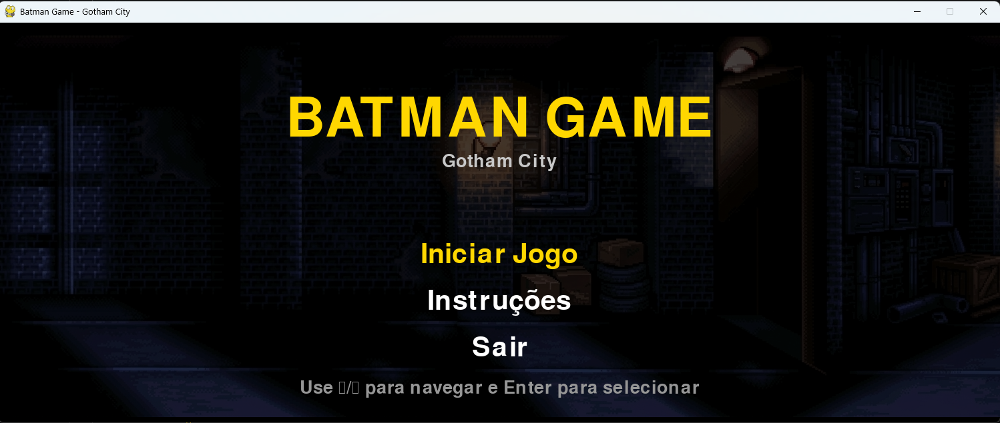

# 🦇 Batman Game - Gotham City

  

Um jogo simples de plataforma com o Batman, desenvolvido em Python com a biblioteca Pygame. O herói de Gotham pode andar, pular, agachar e socar em um cenário com rolagem infinita.

---

## 📸 Capturas de Tela

### Tela de Início

O menu apresenta as opções: **Iniciar Jogo**, **Instruções** e **Sair**. Navegue com as setas ↑/↓ e pressione Enter para selecionar.

---

## 🎮 Gameplay (v1.0.0)

| GIF | Descrição |
|-----|-----------|
|  | Batman em ação – andando, pulando ou socando |
|  | Batman agachado ou em combate |

> **Versão 1.0.0** – Lançamento inicial do jogo. Novas funcionalidades, personagens e cenários serão adicionados nas próximas versões.

---

## 🎮 Controles

| Tecla          | Ação                          |
|----------------|-------------------------------|
| `←` / `A`      | Andar para a esquerda         |
| `→` / `D`      | Andar para a direita          |
| `↑` / `Espaço` | Pular                         |
| `S`            | Agachar                       |
| `P`            | Socar (normal ou agachado)    |
| `ESC`          | Voltar ao menu (durante o jogo) |

---

## 🚀 Como Executar

### Pré-requisitos

- Python 3.8 ou superior
- Pygame Community Edition (pygame-ce)

✨ Funcionalidades Atuais (v1.0.0)

    ✅ Movimento lateral com rolagem infinita de cenário

    ✅ Pulo com física simples

    ✅ Agachamento

    ✅ Sistema de soco (normal e agachado)

    ✅ Animações para cada ação (idle, walk, jump, punch, down, punch_down)

    ✅ Sprites redimensionados (escala 3.0)

    ✅ Estrutura de pastas organizada

    ✅ Tela de início com menu e instruções
    

📜 Histórico de Versões
v1.0.0 (Lançamento Inicial)

    Batman como personagem jogável

    Animações: idle, walk, jump, punch, down, punch_down

    Cenário infinito com rolagem

    Controles: setas, WASD, Espaço (pulo), P (soco), S (agachar)

    Sprites em escala 3.0

    Estrutura de pastas organizada

    Tela de início com menu e instruções

🚀 Próximas Versões (Planejadas)

    v1.1.0: Adicionar inimigos (capangas do Coringa)

    v1.2.0: Sistema de vida e dano

    v1.3.0: Novos personagens jogáveis (Robin, Batgirl)

    v2.0.0: Novos cenários, power-ups, sons e música

🛠️ Tecnologias Utilizadas

    Python 3.14

    Pygame Community Edition 2.5.7

    Git
