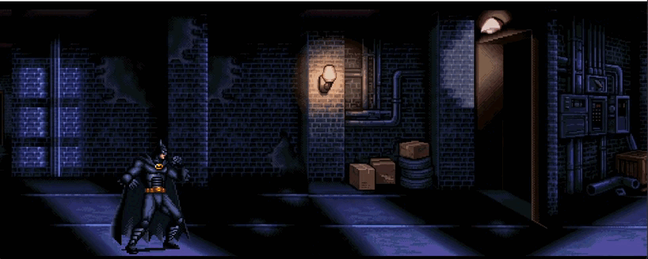

# 🦇 Batman Game - Gotham City

  

Um jogo simples de plataforma com o Batman, desenvolvido em Python com a biblioteca Pygame. O herói de Gotham pode andar, pular, agachar e socar em um cenário com rolagem infinita.

---

## 🎮 Gameplay (v1.0.0)

| GIF | Descrição |
|-----|-----------|
|  | Batman em ação – andando, pulando ou socando |
|  | Batman agachado ou em combate |

> **Versão 1.0.0** – Versão inicial do jogo. Novas funcionalidades, personagens e cenários serão adicionados nas próximas versões.

---

## 🎮 Controles

| Tecla          | Ação                          |
|----------------|-------------------------------|
| `←` / `A`      | Andar para a esquerda         |
| `→` / `D`      | Andar para a direita          |
| `↑` / `Espaço` | Pular                         |
| `S`            | Agachar                       |
| `P`            | Socar (normal ou agachado)    |

---

## 🚀 Como Executar

### Pré-requisitos

- Python 3.8 ou superior
- Pygame Community Edition (pygame-ce)

### Instalação

1. Clone o repositório:

```bash
git clone https://github.com/luizsarmentopereira/batman.git
cd batman
